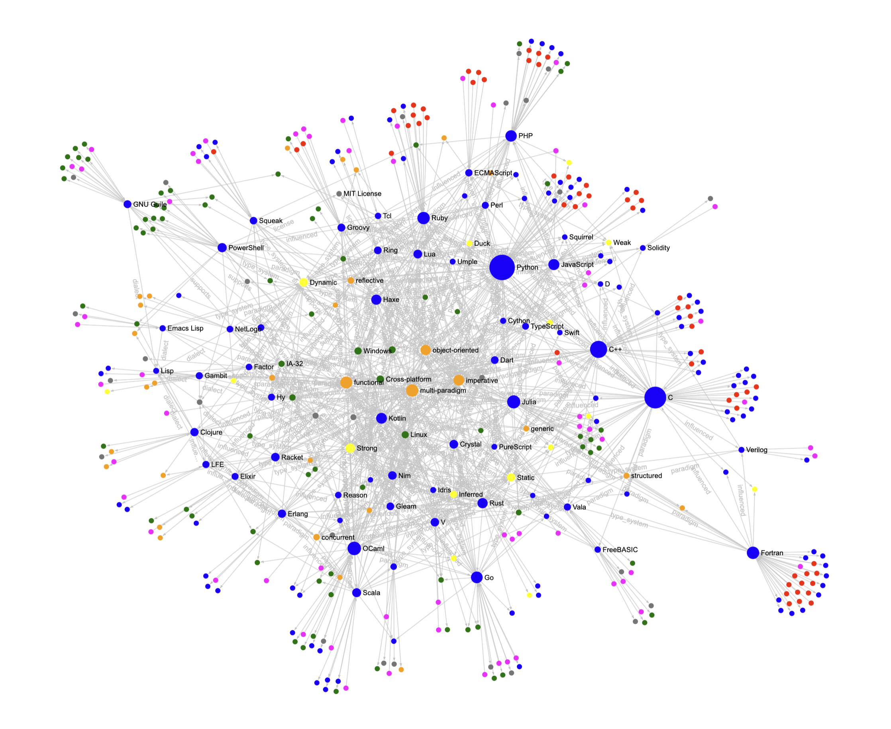
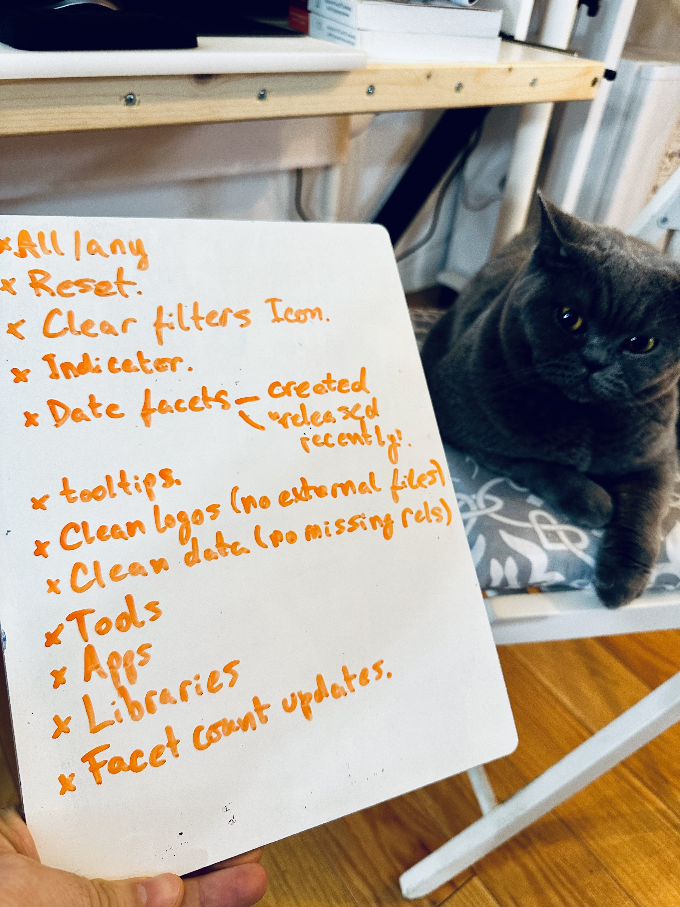

# Plangs

Plangs ambition is to become a community oriented programming languages page where people can find trends, tools and blog posts related to programming languages and the ecosystem of tools, documentation and other resources around them.




# Development

Requirements:

* BunJS
* Overmind

Plangs! is a static website, but a development mode server is provided.

To install the dependencies:

```sh
$ bun install
```

The server and frontend app is wired for "livereloading". A number of processes is required to run CSS bundles (which uses TailwindCSS), JS App budle (which uses ESBuild), and running the livereload enabled dev server (which uses Bun/JS). To wire everything together we use Overmind.

Starting the dev server is as simple as:

```sh
$ overmind start
```

# Building

```sh
$ bun outapp && bun outjs
```

## Screenshots


## Billie

My manager Billie reviewing the pending backlog.


