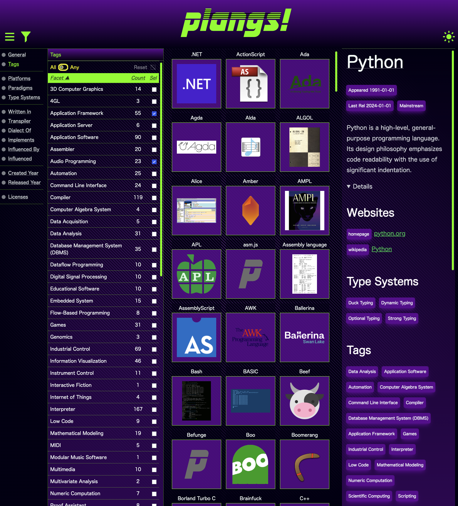
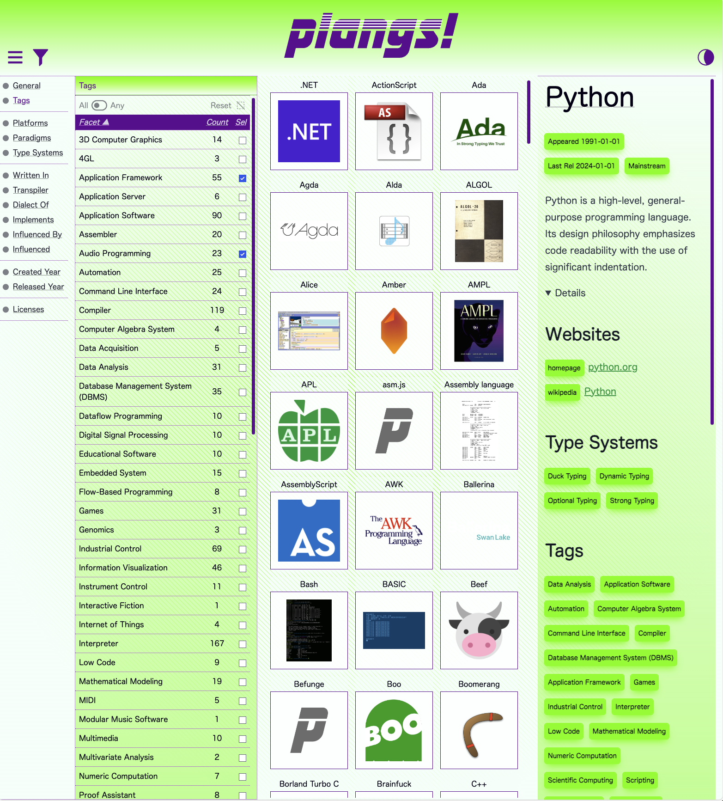
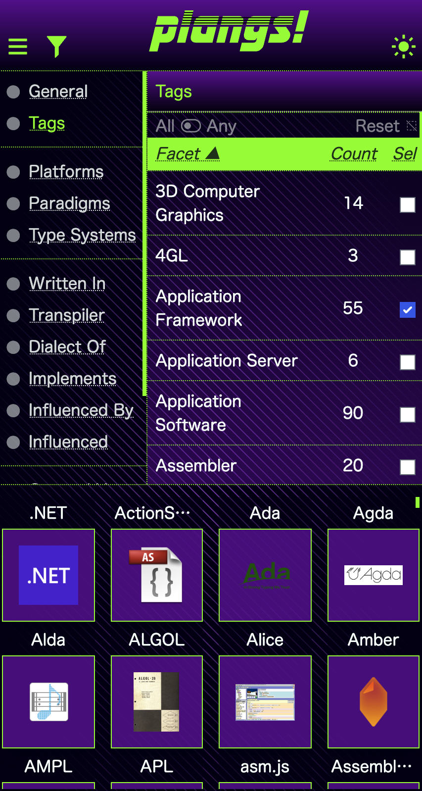

# Plangs

Plangs ambition is to become a community oriented programming languages page where people can find trends, tools and blog posts related to programming languages and the ecosystem of tools, documentation and other resources around them.

# Development

Requirements:

* BunJS
* Overmind

Plangs! is a static website, but a development mode server is provided.

To install the dependencies:

```sh
$ bun install
```

The server and frontend app is wired for "livereloading". A number of processes is required to run CSS bundles (which uses TailwindCSS), JS App budle (which uses ESBuild), and running the livereload enabled dev server (which uses Bun/JS). To wire everything together we use Overmind.

Starting the dev server is as simple as:

```sh
$ overmind start
```

# Building

```sh
$ bun outapp && bun outjs
```

## Screenshots





## TODO

- [ ] Fix facet reset button, and serialization of facets when going to empty (right now doesn't clear the fragment).
- [ ] Fix grid display when there's less than 1 full row of thumbnails. Adjust sizing, etc.
- [ ] Add support for drag/drop resize of elements (node-info and facets-main).
- [ ] Fix layout landscape/portrait switch instead of just by size.
- [ ] Polish info display and facet search.
    - [ ] Support for displayng tools.
    - [ ] Support for displayng apps.
    - [ ] Support for displayng libraries.
    - [ ] Support for displayng learning resources.
    - [ ] Support for displayng communities.
- [ ] Add a simple admin interface to locally tweak the data.
- [ ] Add tests for frontend code.
- [ ] Add schema.org metadata.
- [ ] Add fb opengraph metadata.
- [ ] Add missing aria attributes.
- [ ] Fix "pill" links (do we even want those pills?)
- [ ] Revise data schema for entities other than Plangs.
- [ ] Publish to linode.
- [ ] Add bunny CDN.
- [ ] Kuzu export.
- [ ] Revise data: tags: better-c, educational.
- [ ] Add relationship to data-cleanup entities (Community, Learning).